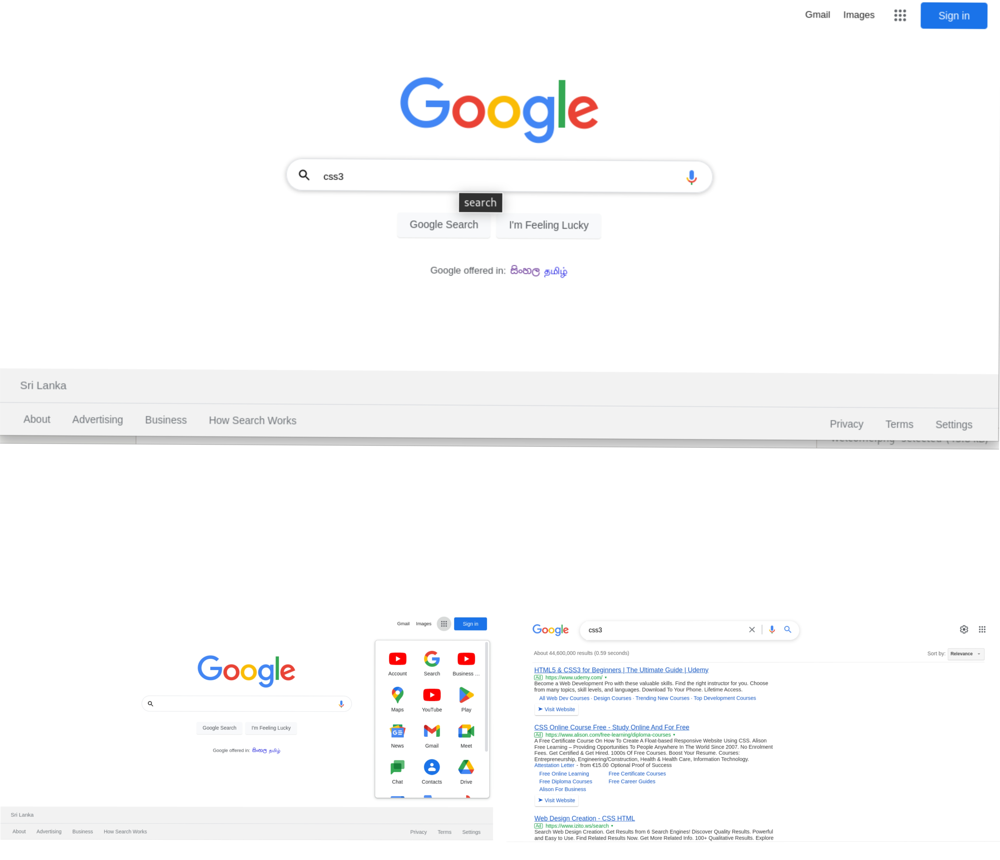
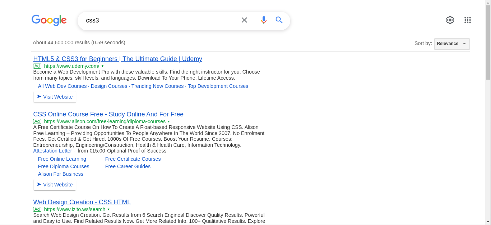

# Google Web Clone
A HTML and CSS application clone of the google.com

* Welcome page

* Search result page

### Languages & Tools
* HTML5
* CSS3 (Flex Layout and Grid Layout)

### Installation

1. Clone the repo `git clone https://github.com/visalsrimanga/BOC-Web-Clone.git`

### Demo

* [Click here](https://visalsrimanga.github.io/BOC-Web-Clone/) to see the demo website.

### version
1.0.0

### Licence
Copyright &copy; 2022. All Right Reserved. 
This project is licensed under the [MIT License](LICENSE.txt)

### Contact Details

* Email: visalsrimanga@gmail.com
* Linkedin: Visal Srimanga

